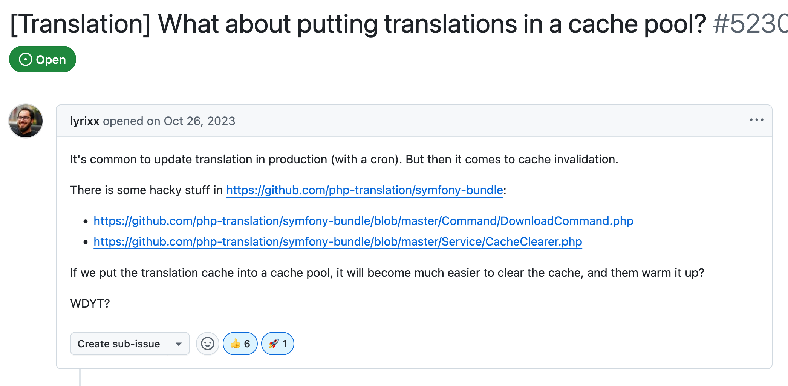

# Pro Tips ©

---
layout: section
---

# Pro Tips ©

## Phone number
Use [odolbeau/phone-number-bundle](https://github.com/odolbeau/phone-number-bundle) to format international phone numbers painlessly.

<v-clicks>

- Doctrine type
- Symfony Form Type
- Twig filter
- Symfony Validator

</v-clicks>

---
layout: section
---

# Pro Tips ©

## Cron / Scheduler

Configure your infrastructure to periodically fetch translations using `bin/console translation:pull` command.

<v-clicks>

This can be handled by a cron job or a scheduler
- [Symfony Scheduler](https://symfony.com/doc/current/scheduler.html)
- [Synolia Scheduler Command Plugin](https://github.com/synolia/SyliusSchedulerCommandPlugin)

</v-clicks>

---
layout: section
---

# Pro Tips ©

In `test` environment, leverage `IdentityTranslator` from Symfony to avoid breaking your tests when translations are changed.
<div class="code-lg">

```yaml
# services.yaml
when@test:
    services:
        translator: '@identity_translator'
```

</div>

https://github.com/symfony/symfony/blob/7.3/src/Symfony/Component/Translation/IdentityTranslator.php

---
layout: section
---

# Pro Tips ©

Be careful with OPCache configuration!
<div class="code-lg">

```ini
opcache.validate_timestamps = 0
```

</div>

⬆️ This will **prevent OPCache from invalidating** the cache when files are changed, **including translations cached files**.

---
layout: section
---

# Pro Tips ©

⬇️ To prevent this, enable `opcache.validate_timestamps` and set the `opcache.revalidate_freq` value.

It will refresh the **whole OPCache** every `{SECONDS}` seconds.
<div class="code-lg">

```ini
opcache.validate_timestamps = 1
opcache.revalidate_freq = {SECONDS} 
```

</div>

⚠️ Use this tip wisely, depending on your production constraints and existing configuration!

---
layout: section
---

# Pro Tips ©

Alternatively, you can decorate `push` and `pull` command to manually clear the OPCache.
<div class="code-lg">

```php
opcache_reset();
// or
opcache_invalidate($filename, true);
```

</div>

---
layout: section
---

# Pro Tips ©

Finally, there is an issue to move translation cache in a dedicated pool.

https://github.com/symfony/symfony/issues/52305



