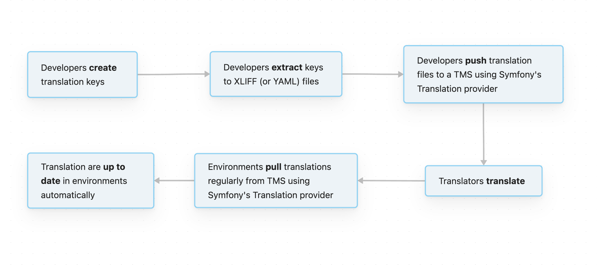
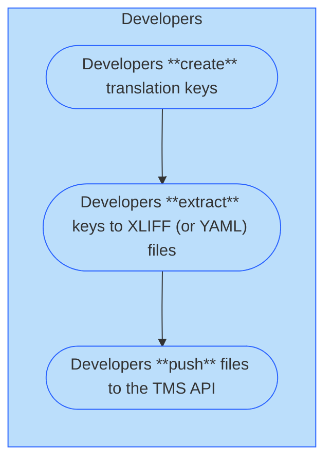
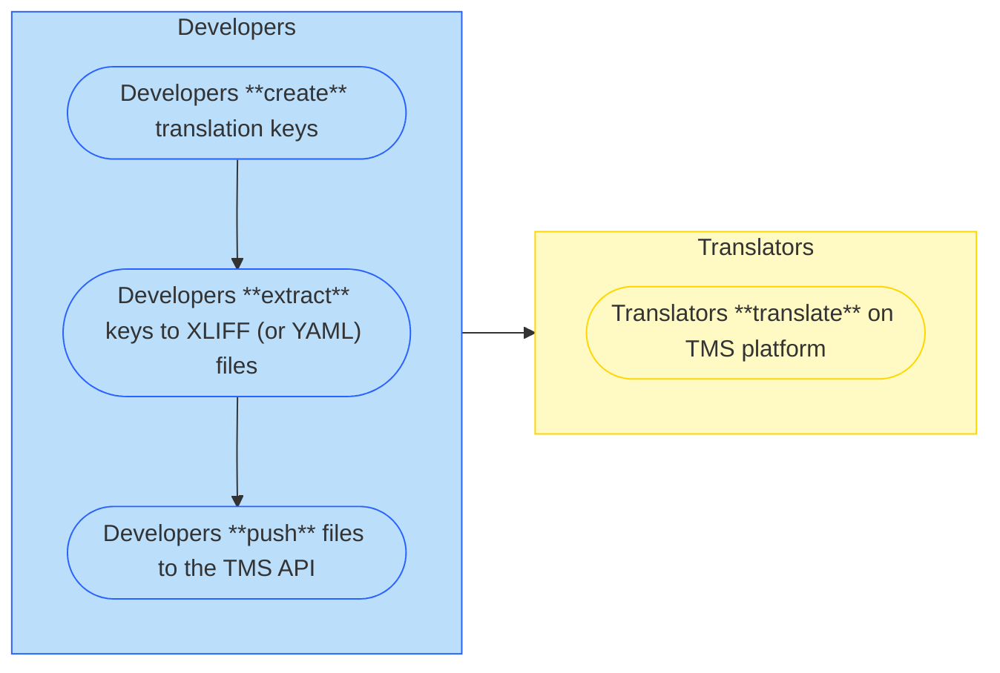
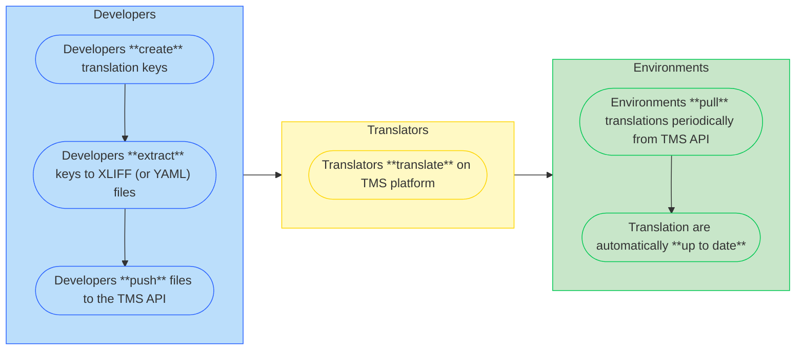

# Targeted workflow

---
layout: section
---

# Main goals

<v-clicks>

- **Avoid direct edition** of XLIFF/YAML files
- **Do not mix up** code and static text
- **Automate** translation keys extraction
- Stick to **translation keys nomenclature**
- **Suppress deployment dependency** to fix a translation

</v-clicks>

---
layout: section
---

# The targeted workflow

<!--  -->

<v-switch>
  <template #1>

  </template>
  <template #2>

  </template>
  <template #3>

  </template>
</v-switch>

<!--
- **1/** Developers create translation keys, 
- extract them to XLIFF/YAML files (using `bin/console translation:extract`, previously `translation:update`) 
- and push them to the TMS via API (using `bin/console translation:push`)

- **2/** Translators translate them on the TMS platform, mark them as "translated" and "approved" (or "rejected")

- **3/** Environments pull translations periodically from the TMS via API (using `bin/console translation:pull`)
-->
