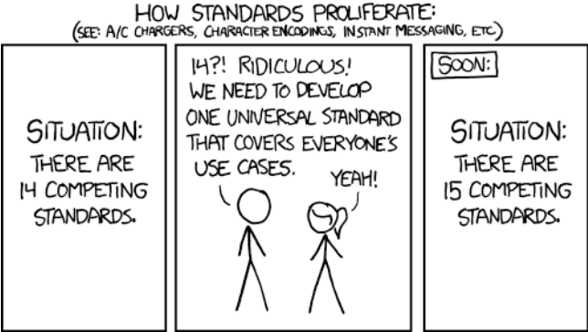
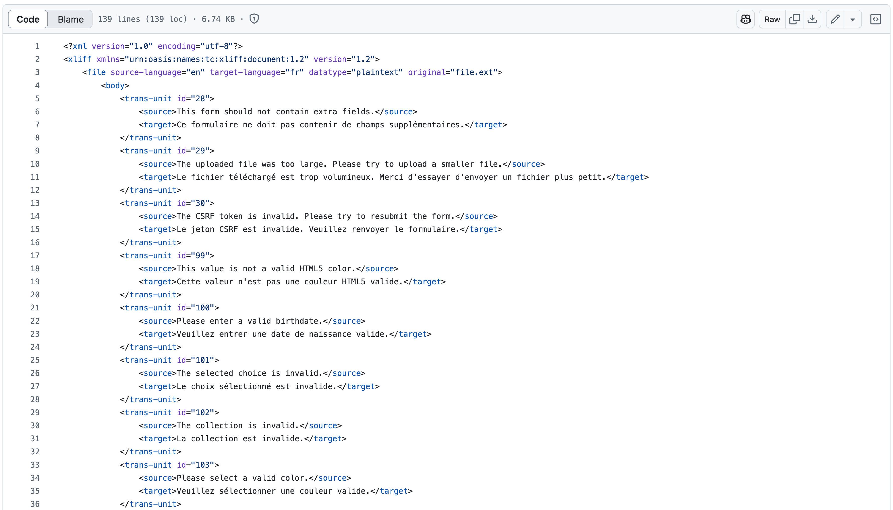
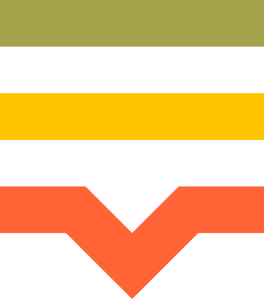
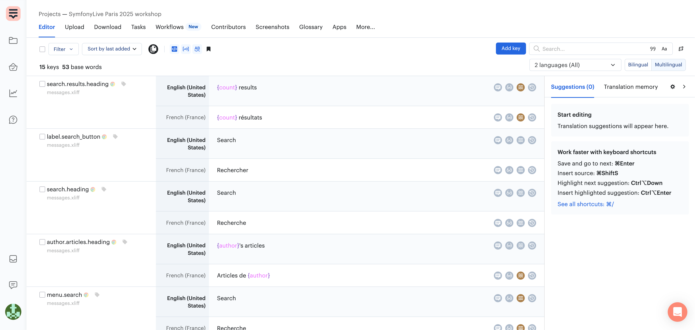

# Translation in software industry

---
layout: section
---

# Translation in software industry

<v-switch>
  <template #1> 

## Translation standard format?

  </template>
  <template #2> 

  </template>
</v-switch>

<!--
- Is there a standard format for translation?
- Yes, but. JSON, INI, YAML, PO, CSV, XLIFF, etc.
-->

---
layout: section
---

# Translation in software industry

<v-clicks depth="2">

- **OASIS** Consortium
- **O**rganization for the **A**dvancement of **S**tructured **I**nformation **S**tandards
- XLIFF Format
    - 1.2 and 2.0 live side by side
- Most complete translation format
    - Source locale
    - Metadata (notes, …)
    - Translation status

</v-clicks>

<!--
- OASIS is in charge of specifying many formats (OpenDocument, AMQP, SAML, etc.)
- One of those translation formats is "more" standard than the others
- XLIFF (XML Localization Interchange File Format)
-->

---
layout: section
---

# Translation in software industry

<!--
Extract of a XLIFF 1.2 translation file from Symfony
-->

---
layout: two-cols-header
---

# Translation Management Systems

## SaaS

::left::

<v-clicks >

- **Lokalise**
- **Crowdin**
- **Loco**
- **Phrase**
- Transifex
- POEditor
- …

</v-clicks>

::right::

<v-click at="1">

</v-click>

<v-click at="2">

</v-click>

<v-click at="3">

</v-click>

<v-click at="4">

</v-click>

<v-click at="5">

</v-click>

<v-click at="6">

</v-click>

<v-click at="7">

…

</v-click>

<!--
- Loco, Lokalize, Crowdin and Phrase are supported by a Translator Provider in Symfony
- If you use another TMS, you are welcome to contribute the corresponding provider to Symfony
-->

---
layout: two-cols-header
---

# Translation Management Systems

## Open Source / Self-hosted

::left::

<v-clicks>

- _Weblate_
- Tolgee
- Accent
- Traduora
- Texterify
- …

</v-clicks>

::right::

<v-click at="1">

</v-click>

<v-click at="2">

</v-click>

<v-click at="3">

</v-click>

<v-click at="4">

</v-click>

<v-click at="5">

</v-click>

<v-click at="6">

…

</v-click>

<!--
- Weblate has a third-party Translation Provider (https://github.com/m2mtech/weblate-translation-provider)
- If you use another TMS, you are welcome to contribute the corresponding provider to Symfony
-->

---
layout: section
---

# Translation Management Systems

<!--
- Here it's a screenshot of Lokalise UI
- Your translators will act here to do the translations
-->
